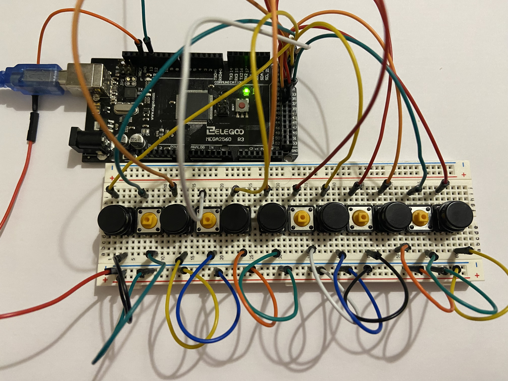

### USAGE:
If there are errors, see the **MANUAL USAGE** section to find out problems.

1. Flash the keyboard_listener on the Arduino
    make -f linear_listener.mk linear_keyboard_listener.hex

2. Compile and start the midi_player
    make -f player.mk
    ./midi_player

3. Connect a wire to a pin and to GND in order to obtain the following notes:

        C:  22
        C#: 23
        D:  24
        D#: 25
        E:  26
        F:  27
        F#: 28
        G:  29
        G#: 37
        A:  36
        A#: 35
        B:  34

4. To close the player connect a wire between pin 12 and GND
    **N. B.:** Remember to close the opened FluidSynth using *quit* in its terminal

5. The image in this folder provides a raw way to simulate a piano keyboard using some buttons and a breadboard
    

6. Start the music and enjoy!

### MANUAL USAGE:
You can use the program this way removing the function *start_synth_and_connect()* in *main* of *midi_player.c* (line 98).

1. Flash the **keyboard_listener** on the Arduino
    make -f linear_listener.mk linear_keyboard_listener.hex

2. Compile and start the **midi_player**
    make -f player.mk
    ./midi_player

3. Install and launch a synth (e. g. FLUID Synth)
    sudo apt-get install fluidsynth
    fluidsynth

4. Type "aconnect -l" to see current connections, you should see something like
    cliente 0: 'System' [tipo=kernel]
        0 'Timer           '
        1 'Announce        '
    cliente 14: 'Midi Through' [tipo=kernel]
        0 'Midi Through Port-0'
    cliente 128: 'Client-128' [tipo=utente]
        0 'Virtual RawMIDI '
    cliente 129: 'FLUID Synth' [tipo=utente]
        0 'Synth input port (10513:0)'

5. Connect the player program with the synth
    aconnect 128:0 129:0

6. Start the music and enjoy!
